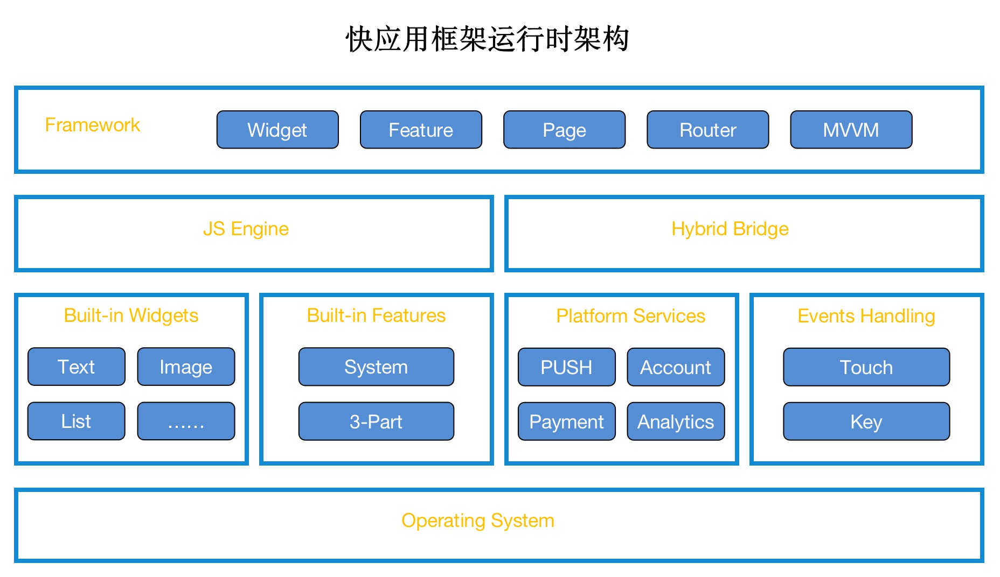
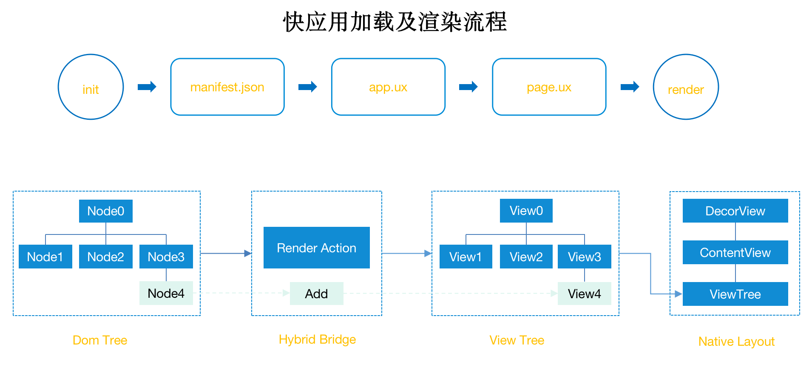

## 快应用服务框架
快应用是一种新的应用形态，以往的手机端应用主要有两种方式：网页、原生应用；网页无需安装，却体验不是很好；原生应用体验流畅，却需要从应用商店下载安装，难以一步直达用户；快应用的出现，就是希望能够让用户无需下载安装，并且还能流畅的体验应用内容。

为了达到上面的目标，快应用建立一种新的语言开发规范，同时提供一系列的开发套件辅助支持。简单来说，开发者主要利用前端知识与技能，以及对应的 IDE，手机设备就可以做原型的开发。快应用使用前端技术栈开发，原生渲染，同时具备 H5 与原生应用的双重优点，开发者使用的前端技术栈资料多，学习成本低。

快应用服务框架能够使用原生组件渲染快应用程序。

## 项目结构
### 项目架构
如图所示，快应用框架架构主要有以下几个部分：


Framework:JS 应用框架层，主要提供了基础的页面组件、页面路由管理、数据绑定以及原生接口等功能。

JS Engine:负责解释页面标签并生成相应的 DOM 树，同时将渲染操作 RenderAction 发送给 HybridBridge

HybridBridge:接收 RenderAction，调用系统原生功能进行渲染

Platform Services:接入三方服务能力，如推送、支付、微信/微博/qq 账户、统计等

### 渲染流程

主要渲染流程如下所示：



框架首先加载 manifest.json 读取应用配置信息，然后读取 app.ux 文件读取其中的公共库信息；
接下来会加载需要展示的 page.ux，也就是我们编写的页面，通过对页面组件、样式的计算，生成相应的 DOM 树；
最后将 DOM 树映射成 Android 原生的 View 树，并在 Activity 的 ContentView 中加载，完成整个渲染流程。

### 代码结构
主要代码结构如下所示：

```
├── core  //核心功能
│   ├── adapters
│   ├── framework
│   ├── plugins
│   └── runtime
├── debug
│   ├── engine
│   └── shell
├── development
│   └── gradle-plugin
├── external
│   └── public
├── mockup
│   ├── platform
│   └── plugins
└── platform
    ├── platform
    └── plugins
```

### 快应用框架代码分包简要说明

#### core 

提供runtime部分代码，即整个框架的核心运作机制，rpk理论上可以通过集成这部分代码独立运行

framework：前端框架与编译器

framework/src：前端框架，输出为一个js文件

runtime：运行时环境

runtime/android：android端运行时环境，输出为android的aar库

runtime/android/runtime：android端核心模块

runtime/android/features：各系统接口的android端实现

runtime/android/widgets：各系统组件的android端实现

plugins/features/*：可公用的各服务类接口，每个的输出为android的aar库

#### debug

框架调试模块，提供调试辅助功能，此模块代码不参与框架编译、打包。

debug/engine：快应用调试功能的核心逻辑，可以抓取运行时渲染数据并在Chrome浏览器中展示

debug/shell：可编译快应用调试器，用于设备端安装、调试快应用

#### development

development/gradle-plugin：框架编译插件，负责类注解解析

#### external

Inspector 以及绘图等依赖 JS/V8 环境的 native 模块编译所需的 JSEnv 头文件

#### mockup

快应用框架 app 工程模块

mockup/platform/android：快应用框架app项目，输出为 apk 文件

mockup/plugin：快应用框架三方接口（账户，支付，推送等）

#### platform

框架平台化的相关机制，例如快应用分发、启动，进程管理等相关逻辑


## 快应用框架编译与安装

快应用框架项目使用 gradle 进行编译。

### 快应用框架编译
在`hapjs/mockup/platform/android`目录下执行

```
./gradlew assembleDebug/Release

```
即可在`hapjs/mockup/platform/android/app/build/outputs/apk/`目录生成相应的android apk安装文件。

```
// 生成的文件，以执行 assembleDebug 为例
// 也可以执行 assemblePhoneDebug 只编译手机平台安装文件
├── phone  //手机平台安装文件
│   └── debug
│       ├── app-phone-debug.apk
│       └── output.json
└── tv     //电视平台安装文件
    └── debug
        ├── app-tv-debug.apk
        └── output.json
```

### 安装到手机

```
cd hapjs/mockup/platform/android

adb install -r -d app/build/outputs/apk/phone/debug/phone/debug/app-phone-debug.apk 

```
### 调试快应用框架

#### 快应用调试器

> 为了方便调试程序，您可以使用快应用调试器，这是一个Android应用程序，主要包含以下功能：

> * 扫码安装：配置HTTP服务器地址，下载rpk包，并唤起平台运行rpk包
> * 本地安装：选择手机文件系统中的rpk包，并唤起平台运行rpk包
> * 在线更新：重新发送HTTP请求，更新rpk包，并唤起平台运行rpk包
> * 开始调试：唤起平台运行rpk包，并启动远程调试工具
> 
> 快应用调试器可以连接到手机系统内的快应用执行环境（需要将系统升级到最新的正式版本），或者您可以单独下载安装快应用平台预览版来提供执行环境。

在快应用调试器的运行平台下拉组件中选择 **快应用预览版(org.hapjs.mockup)** ,然后安装快应用程序即可调试快应用框架。

#### 编译快应用调试器
快应用调试器使用 gradle 进行编译。

在`hapjs/debug/shell/android`目录下执行

```
./gradlew assembleDebug/Release

```

即可生成快应用调试器安装 apk 文件。


## 定制说明


## 开发文档

## 社区流程


