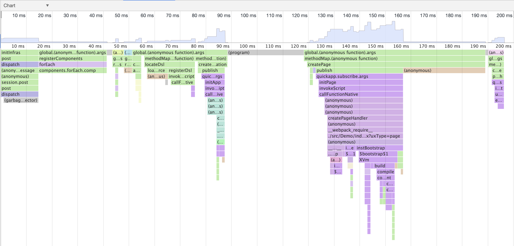

# Framework 性能监控

功能实现 commit:

https://gerrit.sodajs.org/c/hap/quickapp/+/5623

https://gerrit.sodajs.org/#/c/hap/quickapp/+/5703/

## 开启这个功能

1. 修改`quickapp/core/runtime/android/runtime/src/main/java/org/hapjs/system/DefaultSysOpProviderImpl.java` 返回 true

```java
    @Override
    public boolean isAllowProfiler() {
        return true;
    }
```

2. 打开 rpk 测试

3. 拉取测试数据

```bash
adb pull /storage/emulated/0/Android/data/org.hapjs.mockup/files/profiler_log.txt
adb pull /storage/emulated/0/Android/data/org.hapjs.mockup/files/framework.cpuprofile
```

3. 使用 Chrome 打开 framework.cpuprofile，查看火焰图

- 方法：开发者工具 -> JavaScript Profiler 面板 -> 'load'

效果图如下：



## 修改监控位置

修改起止监控位置即可。当前实现监控起点为`src/infras/entry/main/index.js 中 initInfras`方法；监控终止点为`src/infras/dock/interface.js 中 changeVisiblePage`方法。
